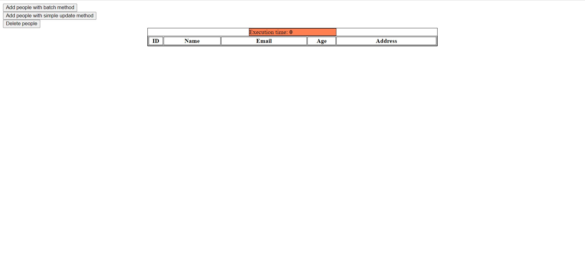

# This project for showing the difference in execution time between update and batchUpdate methods
These instructions will help you with how to deploy the project and how to use the project.

## In the project we used:
- Spring JdbcTemplate.
- Thymeleaf-Spring5.
- PostgreSQL.
- HTML page. 

## How do I execute the project?
For deploying we should have the Docker. 
All configurations for PostgreSQL and Tomcat are in docker-compose and dockerfile files.

To execute you must run these snips of code in the terminal:
- `docker system prune --volumes`
- `docker-compose up`
 > after all this command click here for paging on the browser http://localhost:8080/person

## When the project is deploying and we see a page in browser
At first, you will see an empty table with a head and with the text 'Execution time: 0'
On top of the page, you will see three buttons:
- If you will click on the first button then you will update the database with the batchUpdate method, and 'Execution time: ' will be any number.
It is the execution time of the batchMethod.
- If you will click on the second button you will update the database with a simple update method, and you will have a big number 
in front of the text 'Execution time:' but it will be big number than with bacthUpdate
- You can click the delete button to drop the whole table. Do not worry I wrote the DML create table query in the repository.

## Conclusion 
> If we start add list of any object into database with update method of JdbcTemplate than update method will insert every object separately every time.

But batchUpdate method works with another a way. 
Batch update callback interface used by the JdbcTemplate class.
In second parametr of batchUpdate method we set BatchPreparedStatementSetter interface as anonym class.
This interface sets values on a PreparedStatement provided by the JdbcTemplate class, 
for each of a number of updates in a batch using the same SQL. 
Implementations are responsible for setting any necessary parameters. SQL with placeholders will already have been supplied.
Implementations do not need to concern themselves with SQLExceptions that may be thrown from operations they attempt. 
The JdbcTemplate class will catch and handle SQLExceptions appropriately.
